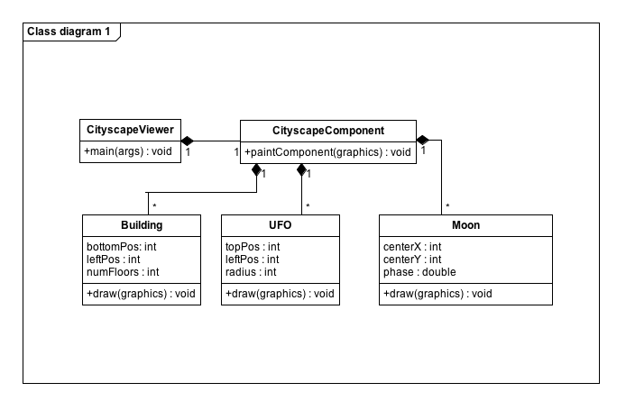

Cityscape Lab

# Introduction

The goal of this lab is for you to demonstrate that you can define classes, create objects, and display graphics via a Java application.

# Requirements

* Commit to GitHub, at least daily, with a meaningful commit message describing what you accomplished and what needs to be done next.

* Create a Java graphical application (with a Viewer class, Component class, and other classes) that displays a cityscape.

* Complete each milestone and demonstrate to your instructor for feedback before continuing to the next milestone.

* **Milestone #1**

    * design one class for an element of the cityscape (e.g., building, window, sun, moon, car, tree)

    * demonstrate good class design (encapsulation)

    * provide configurability through constructors and instance variables (size, color, etc.)

    * demonstrate this milestone to your instructor and receive feedback

* **Milestone #2**

    * create multiple instances of at this class with different properties and display in the cityscape

    * demonstrate this milestone to your instructor and receive feedback

* **Milestone #3**

    * design at least two additional classes, at least three in total, for elements of the cityscape (e.g., building, window, sun, moon, car, tree)

    * demonstrate good class design (encapsulation)

    * provide configurability through constructors and instance variables (size, color, etc.)

    * demonstrate this milestone to your instructor and receive feedback

* **Milestone #4**

    * Animate at least one object in the cityscape. The animation must be purposeful, not random. This means that you must modify an attribute of an object and that object must persist across calls to the paintComponent method.

    * demonstrate this milestone to your instructor and receive feedback

* Document all classes using JavaDoc comments as demonstrated in our [code template](https://drive.google.com/file/d/18U-gWhzdb5q6cDMV5up-e0itlunQtbrA/view?usp=sharing).

Here is an example design class diagram to illustrate the relationship among the classes in this proj

# Extensions

* Define additional classes for additional elements of the cityscape.

* Randomize your cityscape (a different cityscape every time)

* Add More Awesome.

# Submission

* Submit a link to your GitHub repository for this assignment in Canvas.

* If you would like your Cityscape Lab featured on the school TVs, take a short screencast of your animated cityscape and add it to the [shared Google slide deck](https://docs.google.com/presentation/d/14IW5sJouviuovVNltOEZ7c07yGXbFbjXZTOx47t37wE/edit#slide=id.p) based on the provided template slide.

